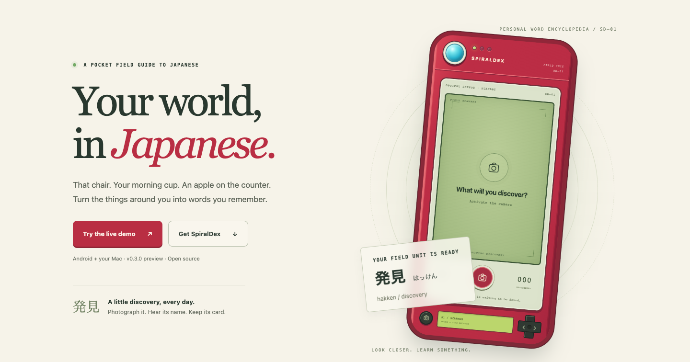
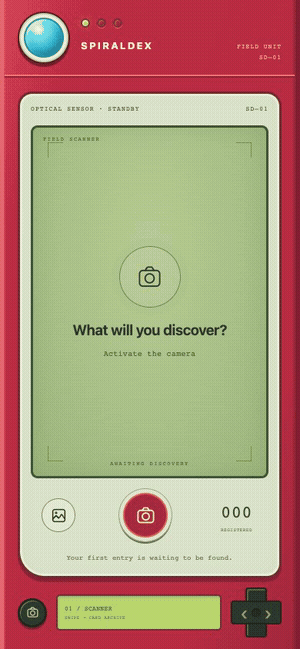
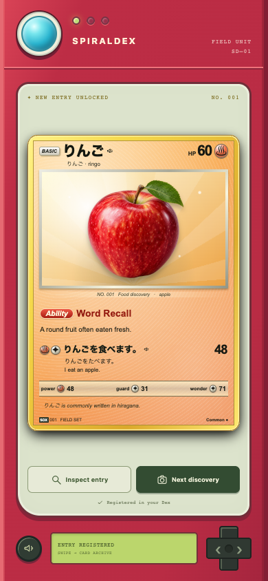
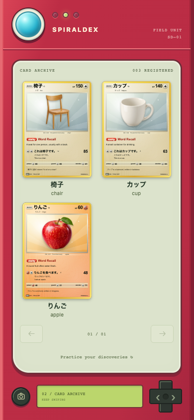
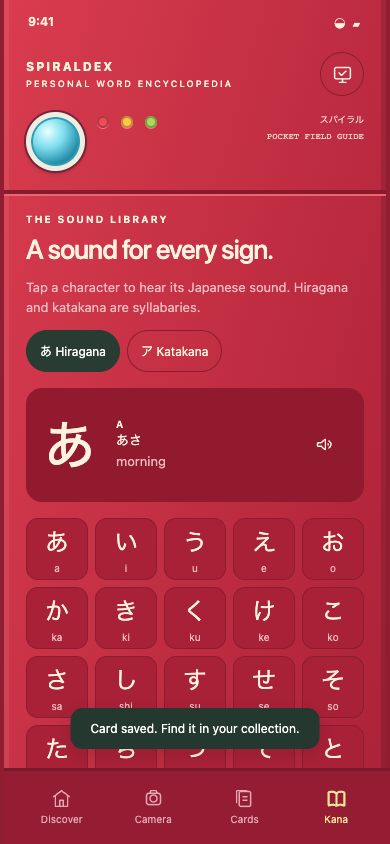
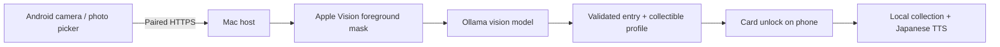

<p align="center"></p>
<h1 align="center">SpiralDex</h1>
<p align="center"><b>Your world, in Japanese.</b><br>A pocket field guide that turns everyday objects into words you remember.</p>
<p align="center"><a href="https://edtireli.github.io/spiraldex/">Explore the demo</a> · <a href="https://github.com/edtireli/spiraldex/releases/tag/v0.3.2">Download v0.3.2</a> · <a href="#quick-start">Get started</a></p>



Take a photo on your Android phone. Your Mac removes the background, identifies the subject with a local vision model, and drafts a Japanese vocabulary card. A completed card unlocks and joins your collection automatically. Inspect it and tap to hear the word.

SpiralDex brings the tactile red shell and discovery ritual of a classic handheld encyclopedia to the little things around you. Your morning cup becomes **カップ**. An apple becomes **りんご**. The language starts to feel like part of your world.

**Early preview:** Android 9+ · macOS 14+ · Ollama · GPL-3.0 distribution. New scans need an awake Mac on the same network. This is an Android app with a Mac companion; there is no iOS release yet.

## See it in motion

<p align="center"></p>

[Try the interactive Classic Dex](https://edtireli.github.io/spiraldex/demo/01-classic.html) — no account or model installation needed. The public demo uses curated samples; it does not upload photographs or perform recognition. Japanese audio uses a voice installed on your device.

<p align="center">
  
  
  
</p>

[Compare the four card finishes](https://edtireli.github.io/spiraldex/demo/card-lab.html) — actual upstream base, reverse-holo, regular-holo, and gallery-holo styles, with phone tilt and pointer/touch lighting. This visual comparison deliberately shows one prepared object in all finishes; live rarity comes from the model.

## What you can do

- **Discover through your camera.** Start with an empty optical scanner. Capture or choose a photo to begin scanning immediately.
- **Lift the subject out.** Apple Vision produces a transparent cutout on your Mac.
- **Make a word card.** Japanese spelling, hiragana reading, romanization, meaning, examples, and notes arrive with an automatically selected type, rarity, finish, HP, and field ratings.
- **Hear the language.** Tap words, examples, or kana. Android uses an installed Japanese voice, including a slower playback option.
- **Collect and recall.** Cards register automatically. Your first swipe can go left or right: Scanner → Card archive → Kana library. Continue that way to advance, or reverse to go back; use the physical D-pad or arrow keys too. The main device does not scroll.
- **Tilt to catch the light.** Cards rotate and move gently with your phone, including their foil reflections. Motion starts automatically in the Android card views. Recenter in inspection or turn it off in settings; reduced motion is respected. Sensor data stays on your phone.
- **Explore kana.** 46 basic hiragana and 46 basic katakana, with sounds and examples.
- **Use your own models.** HTTPS pairing, certificate pinning, and a private token connect the phone to your laptop. No cloud inference API is required.

## Quick start

### 1. Install the Android app

Download **`SpiralDex-0.3.2.apk`** from [Releases](https://github.com/edtireli/spiraldex/releases/tag/v0.3.2), open it on your Android device, and allow installation from that source when Android asks. The APK is signed with the project's release key. It is a direct installation preview, not a Play Store release.

### 2. Prepare your Mac

Install [Python 3](https://www.python.org/downloads/macos/) (3.10 or newer) and [Ollama](https://ollama.com/download/mac), then download the default vision model:

```sh
ollama pull gemma3:12b
```

Keep Ollama running. Gemma 3 12B is a substantial model; a Mac with 24 GB or more memory is recommended for this configuration. A different installed **vision-capable** model can be selected with `DEX_VISION_MODEL`; smaller alternatives have not been validated for this release.

Download **`SpiralDex-Mac-Host-0.3.2.zip`**, extract it, and open **`Start SpiralDex.command`**. If macOS blocks an unsigned downloaded launcher, use its Open / Privacy & Security approval flow. The launcher:

1. Creates a local Python environment and installs Pillow on first use.
2. Uses the included universal Apple Silicon / Intel subject-extraction helper.
3. Creates private pairing credentials in `~/.spiraldex`.
4. Displays your Mac's address, pairing token, and certificate fingerprint, then starts the host.

Keep this Terminal window open while scanning. Initial dependency and model downloads need an internet connection; inference runs locally afterward. The Mac host ZIP is a portable Python companion, not a notarized macOS application or a bundle of model weights.

### 3. Pair and discover

Keep the phone and Mac on the same trusted network. In SpiralDex, tap the blue lens → **Pair with your Mac**. Enter the HTTPS address (normally port `8445`), pairing token, and SHA-256 fingerprint shown in Terminal. Tap **Test connection**.

Activate the camera or choose a photograph. The unit traces the subject, consults the Dex, then reveals a complete, automatically saved card. If several subjects are found, tap one in the retained photograph and retry. Inspect any unfamiliar reading or label; corrections live inside **Inspect entry**. The first scan can take longer while the model loads.

Already use Spiral Chat? Set `SPIRALCHAT_GATEWAY_DIR` to its existing identity directory before starting the host. SpiralDex can reuse `config.json`, `cert.pem`, and `key.pem`; its service uses port `8445` independently of Spiral Chat. Existing files are never silently replaced.

**DuckDNS and a shared port:** v0.3.2 accepts an HTTPS hostname with an optional gateway prefix, such as `https://edspiral.duckdns.org:8443/spiraldex`. A trailing slash is optional. The app preserves `/spiraldex` for health, scan, and progress requests. This address works only after your gateway has a matching authenticated route to the SpiralDex host; the APK does not install that route in Spiral Chat. DuckDNS alone does not forward ports or route requests. A direct host address, such as `https://edspiral.duckdns.org:8445`, still requires that port to be reachable. Use the token and certificate fingerprint for the endpoint you connect to.

## How it works



The model supplies bounded text fields and one of six types. Hiragana fields are constrained during generation and validated afterward. The model judges the object’s rarity from visible evidence and returns its reason and finish. Common and uncommon entries stay non-holo; rare entries use holo or reverse holo, and ultra rare entries use full-art holo. No word hash determines rarity. HP and the three field ratings remain stable game attributes, not physical measurements. Existing entries without a model assessment show “Unassessed” until rescanned. It cannot supply HTML, scripts, arbitrary image URLs, or layouts. The host validates the response against a fixed contract; the app renders the card. Generated facts and labels can still be wrong. Background removal is not evidence that the classification is correct.

Photos are resized and re-encoded before upload. Temporary processing files on the Mac are deleted after each scan. Saved cards contain the cutout and vocabulary data in the app's local IndexedDB. There is no account, collection sync, or telemetry in SpiralDex. See [privacy and storage](PRIVACY.md).

## Run from source

```sh
git clone https://github.com/edtireli/spiraldex.git
cd spiraldex
python3 -m venv .venv
source .venv/bin/activate
python -m pip install -r requirements.txt
clang -O2 -mmacosx-version-min=14.0 \
  -framework Foundation -framework Vision -framework CoreImage \
  -framework CoreVideo -framework CoreGraphics host/segment.m -o host/segment
python host/server.py
```

Open **http://127.0.0.1:8137** for the app on your Mac. Building the subject extractor from source requires Xcode Command Line Tools. For the phone host, run `./"Start SpiralDex.command"` instead.

The public demo is entirely static:

```sh
python3 -m http.server 8142 --bind 127.0.0.1 --directory docs
```

Open **http://127.0.0.1:8142**. It works without Ollama or the Mac segmentation helper.

| Folder | Purpose |
| --- | --- |
| `web/` | Canonical HTML, CSS, JavaScript, kana, and demo assets |
| `android/` | Native camera, TTS, encrypted pairing storage, and pinned HTTPS bridge |
| `host/` | Python API, pairing setup, and Apple Vision helper |
| `docs/` | Static project page, sample-only app, and media |
| `scripts/` | Asset sync, local release build, screenshots, and Terminal publishing |
| `tests/` | API contract, browser, and public demo checks |

## Configuration

| Setting | Default | Purpose |
| --- | --- | --- |
| `DEX_VISION_MODEL` | `gemma3:12b` | Installed Ollama vision model |
| `SPIRALDEX_IDENTITY` | `~/.spiraldex` | Private token and certificate directory |
| `SPIRALCHAT_GATEWAY_DIR` | Unset | Optional reuse of a Spiral Chat identity |
| `SPIRALDEX_DICTIONARY` | Unset | Optional local JSON mapping words to `[reading, ...]` for an exact reading match |
| `--port` | `8137` / `8445` | Browser preview / HTTPS phone host port |

The optional dictionary is not bundled. A reading match checks only that spelling/reading pair, not the model's identification or generated prose. Model weights and third-party dictionaries keep their own licenses.

## Current limits

- The host currently requires macOS 14+; there is no Windows/Linux segmentation backend.
- Object recognition and readings need review. Inspect a card to correct its name, reading, or meaning. Correcting a name clears its previous generated notes.
- Basic kana only; voiced, semi-voiced, and combined sounds are planned.
- Recall is a simple self-check, not a spaced-repetition system or proficiency score.
- Saved cards work offline. New scans need the Mac. There is no durable offline photo queue or cross-device sync.
- Cancelling stops waiting on the phone; a running model job can finish on the Mac.
- TTS needs an installed Japanese voice. The app's voice settings shortcut helps when one is missing.
- A generated pairing certificate lasts one year. Renewing it requires re-pairing the app.

## Development and releases

See [CONTRIBUTING.md](CONTRIBUTING.md) for browser tests, Android builds, signing, and local packaging. Release artifacts are built locally and uploaded directly; this repository contains no paid CI build workflow. GitHub Pages serves the prebuilt `docs/` directory using its normal Pages deployment.

See [TESTING.md](TESTING.md) for this release's verification and limits, [CHANGELOG.md](CHANGELOG.md) for changes, and [CREDITS.md](CREDITS.md) for assets and inspiration.

SpiralDex is an independent learning project inspired by classic handheld field guides. It is not affiliated with Pokémon, Nintendo, or The Pokémon Company. Card effects use the actual GPL-3.0 CSS from [Simon Goellner’s pokemon-cards-css](https://github.com/simeydotme/pokemon-cards-css), pinned and bundled locally. The vocabulary faces are SpiralDex HTML; no Pokémon card scans or illustrations are bundled. The combined distribution is GPL-3.0; original MIT notices are retained in `licenses/`. Corresponding source is included in each release.
